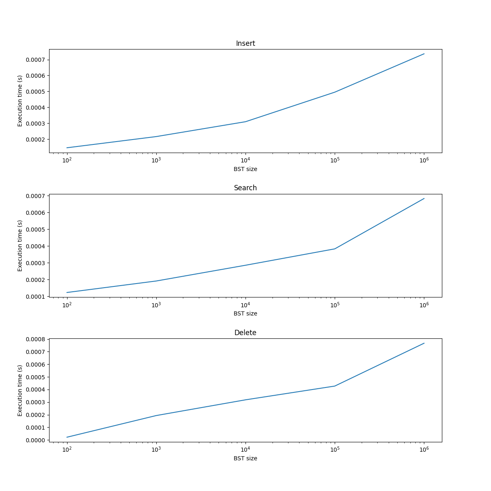
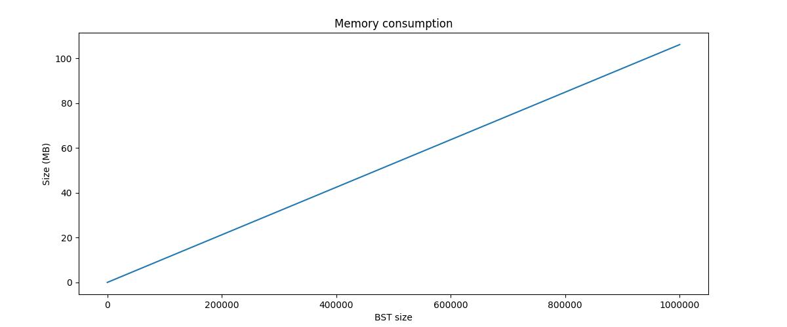

# Profiling

Profiling in Python can be done with internal libraries. In this example used [cProfile](https://docs.python.org/3/library/profile.html) for measuring time complexity and [tracemalloc](https://docs.python.org/3/library/tracemalloc.html) for measuring memory allocation.

We would be verifying time and space complexity for Binary Search Tree, results should show O(n) for space complexity and O(log(n)) for search, insert and delete operations.

### Requirements:
 - [python](https://www.python.org/) >=3.10 
 
### Setup

For script execution, need to install python libraries from `requirements.txt` (inside activated python environment): 
```shell
pip install -r requirements.txt
```

### Binary Search Tree

To check the complexity of search and insert in BST just need to run next command: `python main.py`. Data would be shown in output, and charts with that data would be generated in root folder.
```
python main.py

Inserting/searching/deleting of 20 random integers (in same range of generated BST) ...
+----------+----------------+----------------+----------------+
| BST size |     Insert     |     Search     |     Delete     |
+----------+----------------+----------------+----------------+
|      100 | 0:00:00.000146 | 0:00:00.000123 | 0:00:00.000022 |
|     1000 | 0:00:00.000216 | 0:00:00.000191 | 0:00:00.000194 |
|    10000 | 0:00:00.000309 | 0:00:00.000285 | 0:00:00.000318 |
|   100000 | 0:00:00.000495 | 0:00:00.000383 | 0:00:00.000427 |
|  1000000 | 0:00:00.000736 | 0:00:00.000683 | 0:00:00.000766 |
+----------+----------------+----------------+----------------+


Calculating allocated memory ...
+----------+------------------+
| BST size | Memory used (MB) |
+----------+------------------+
|      100 |           0.0066 |
|     1000 |            0.102 |
|    10000 |           1.0554 |
|   100000 |          10.6352 |
|  1000000 |         106.1503 |
+----------+------------------+
```





Result shows, as expected, that space complexity of BST is O(n) and insert, search and delete operations have time complexity of O(log(n)).
